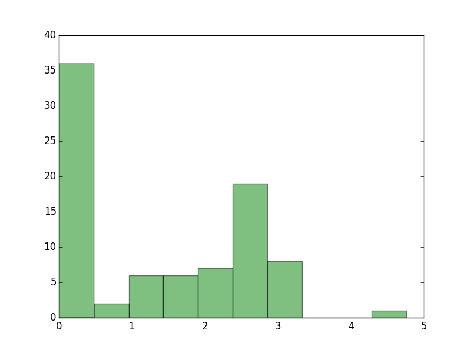

``caravan.dat``
===============

The file ``caravan.dat`` contains profile data on potential purchasers of caravan insurance. Associated with the data
is a binary side data indicating whether or not a person actually bought a caravan insurance or not. The task was to
pack the profile data as tightly as possible, using the side information to improve packing, if possible. The data
itself contains 85 parameters for each individual person, and the description of each parameter was given also.
The size of the data was 995kB.

The first reaction was to try how well bzip2 could pack the data. It achieved a formidable packing performance, squeezing
the original file into about 59kB, which is about 5.9 percent of the original size.

We then tried to figure out whether it would make sense to manipulate the data in such a way as to make it easier
for bzip to pack it even more. We came up with the idea that the data could be divided into one or more separate parts,
where the entropy of the columns would be roughly the same in each part. We implemented this approach by generating a
list of entropies for each column and separated those columns where entropy was below the threshhold of 0.5 from the
rest of the data. These columns comprised almost 50 procent of the data, and bzip was able to pack them really efficiently
into about 3 kB. The rest of the data still took about 49kB, but this approach enabled us to reach a slightly better
compression, now compressed file now taking about 52kB of space.

.. _caravan_1:

	Figure 1. A histogram of entropies of different columns. A large number of columns have entropy smaller than :math:`0.5`.

We also generated a table of the mutuals informations between pairs of columns. This enabled us to notice that
the fifth column could be read off from the first one without exceptions. Due to time pressure we were unable to
implement a code to take advantage of this discovery. The next step after this would have been to write a code
that generates for each data column :math:`X` a list of other columns that have a big mutual information relative to :math:`X`.
This would have made it possible to choose a selection of column, with respect to which we could have encoded the
remaining columns, thus achieving better compression due to decreased conditional entropy for the remaining columns.