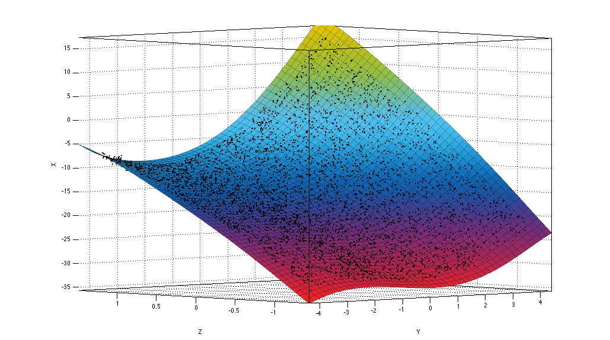

``final.dat`` 
=============

This data consists of data file ``final.dat`` and side information file ``final.sdat``.
Data file has 20000 floating point numbers separated by new lines and side 
information contains two floating point numbers for each line in data file. Data and
side information was grouped line by line to form a three dimensional
space :math:`(X,Y,Z)`. Each data point is then a 3-tuple 
:math:`(x, y, z)`, where :math:`x` contains data to compress and :math:`y` and :math:`z` the 
two side information columns. For closer inspection, the data was plotted in 3D 
space as is seen in Figure 1. When inspecting the figure, we can see that the 
data seems to have two distinct shapes, or planes, in it. 

.. _final_1:

	Figure 1. Data (:math:`X`) and side information (:math:`Y`, :math:`Z`) plotted in 3D space.
	
.. note::

	There is a small side question if the upper shape should be modeled as two shapes in itself,
	divided by the rip in the shape around :math:`z = 0.5`; or if the lower plane 
	actually starts from the rip and is somehow mirrored with respect to
	:math:`Z`-axis.

We first tried to fit single plane on the data, but the basic polynomial fitting functions 
could not handle the sharp curve around the maximum of :math:`Z`-dimension. This lead 
us to an idea to divide the data into two sets using a plane. For optimal dividing 
plane, we fitted a curve on the data points near the maximum of :math:`Z`-dimension 
(threshold :math:`0.05`), which can be seen in Figure 2. Using this curve we can
obtain a plane in Figure 3. and split the data into two sets depending if the
point is under or above the plane.
	

.. _final_curve

.. figure:: figures/final_curve.png	

	Figure 2. Curve fitted to data points near the maximum of :math:`Z`.
	
	
.. _final_1plane

	Figure 3. Splitting plane generated from the curve in Figure 2.
	
Once data was divided, it was easy to fit a single plane into both of the sets
using polynomials found from Matlab's curve fitting tool. We used polynomials
of order 5 (probably order 3 would have been sufficient and 
saved some decompressor size because of fewer coefficients), i.e.

.. math:: x = c_1 + c_2y + c_3z + c_4y^2 + c_5yz + c_6z^2 + \dots + c_{19}y^2z^3 + c_{20}yz^4 + c_{21}z^5 .
 

The obtained 
planes can be seen in Figure 4. and Figure 6., and the residuals between the planes and 
the data points in Figure 5. and Figure 7.
	
	
.. _final_split0_plane

	Figure 4. Plane fitted to points under the splitting plane.
	
	
.. _final_split0_residuals

.. figure:: figures/final_split0_residuals.png

	Figure 5. Residuals of data points in question compared to plane in Figure 4.

.. _final_split1_plane

.. figure:: figures/final_split1_plane.png

	Figure 6. Plane fitted to points above the splitting plane.

.. _final_split1_residuals

.. figure:: figures/final_split1_residuals.png

	Figure 7. Residuals of data points in question compared to plane in Figure 6. 
	The rip in the data around :math:`z = 0.5` can be seen in the residuals.
	

After obtaining the residuals we used mixed model to compress the data: (a) choice between two plane models,
sign of a residual and residual's integer part was grouped together, and (b) the 
residual's decimal part was handled separately. 

For (a) we used ``+`` and ``-`` to mark plane models above and below the dividing plane,
respectively, and concatenated this information with the sign (also ``+`` and ``-``) and 
the integer part of the residual. With this procedure we obtained strings like ``+-1`` or ``-+0`` for each residual.
These strings were then used as individual symbols for Huffman code generation.

For (b) we observed, that the original data was given with floating point precision
at most 3. This leads to the fact that storing 3 digits of residual decimals will
be sufficient to obtain any of the original data points when combined with the 
plane model used in calculating the residual. We rounded each residual's decimal 
part to a fixed floating point precision 3 and concatenated
the results as a string, which yielded us a string of length 60000. This string
was then Huffman coded using each character, i.e. digits from 0 to 9, as individual symbol.

Finally we added the information of the (symbol, code) -mappings (see :ref:`huffman` for details) into the start 
of both parts (a) and (b) and concatenated the results to obtain the compressed 
binary file.
