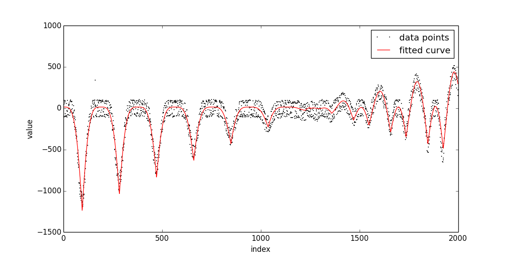
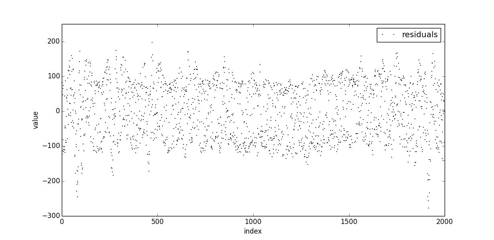
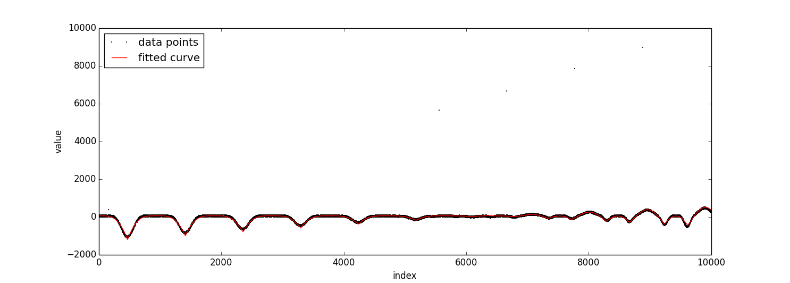
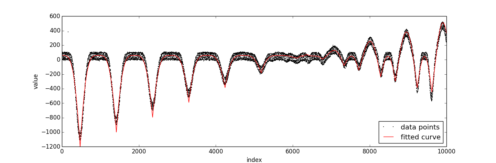
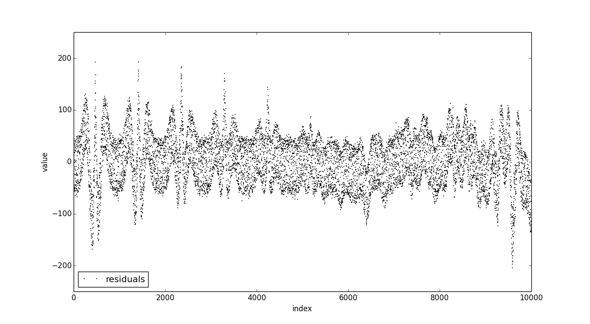

``curve1.dat`` and ``ty.txt`` 
=============================

Model
-----

Data files ``curve1.dat`` and ``ty.txt`` consist of 2000 and 10,000 floating point numbers of precision at most 2, separated by line breaks. 
We plotted these as a function of the index of the number in the file, and found out that both files seem to have almost 
exactly similar periodic behaviour. The behaviour of the curve seems to change after the first :math:`\frac{5}{8}` of the 
data, so  we decided to model it in two parts.

The first part has some periodic 'bumps', and the first data point seems to be on top of one of such bumps so we started 
the modelling with a cosine function. As the bumps are round, but the deeps are really sharp, we took the absolute value, 
ranging now from :math:`0` to :math:`1`. Next, we wanted the top of the bumps to be at the same level, but the deeps to 
approach the :math:`x`-axis linearly. We dropped the function values by one (:math:`|\cos(x)|-1`), and multiplied with a 
(decreasing) linear function of the form :math:`ax+b`. Now we already achieved a considerably good fit, but the bumps 
were not quite wide enough. We first tried to solve this by using a higher wave and then cutting the tops of the bumps 
off, but later found an even better fit by squaring the :math:`|\cos(x)|-1`-part and multiplying by :math:`-1`.

In the second part of the data, we're again dealing with bumps, but this time there's two kinds of them: every other bump 
has equal height (at about :math:`0`), whereas every other seems to increase linearly. The deeps seem to decrease linearly 
in either case. We started again with a cosine function, and to achieve bumps with unequal heights we first added a 
constant :math:`0<h<1`, and then took the absolute value. Now we dropped the curve by :math:`1-h` to get the tops of 
the lower bumps to zero (to keep them equal after multiplication with a function), and finally multiplied this all 
with a linear function.

The final model was augmented with extra parameters for optimal fit (the tops of the bumps not exactly at zero etc.) and 
scaling (the period was not :math:`\pi`). The final model was of the form 

.. math::
	:label: model

	m(x)=\left\lbrace \begin{array}{ll}  -\, \lvert \,ax+b\, \rvert  \cdot \big( \lvert \, \cos(cx)\, \rvert -1 \big)^2 +d, & &\text{ if }x<\frac{5}{8}n\\
	(ex+f)\big( \lvert \,\cos(gx+h)+i\,\rvert+j\big)+k, & &\text{ otherwise.} \end{array} \right.

where :math:`n` is the number of data points in the file. 

Compression
-----------

After obtaining the model, we treated the files in different manner, mostly because
``curve1.dat`` did not have enough data points for doing meaningful compression 
based on e.g. Huffman coding.

``curve1.dat``
**************

As ``curve1.dat`` contained only :math:`2000` data points, the first experiments showed
that its size was impossible (to our knowledge) to  compress below the size 
of :command:`bzip2`-file with Huffman coding or similar techniques. However,
we saw that given our fitted model, the residual's absolute integer values
were restricted to a set which was less than :math:`2^8`, this lead to an 
encoding, where we first encoded the signs of the residuals (:math:`2000` bits), then 
the integer value (:math:`8 \cdot 2000` bits) and then the decimal parts (:math:`7 \cdot 2000` bits), and
simply concatenated these into :math:`4000` bytes. In Figure 1. we can see the data and the
fitted curve, and in Figure 2. the residuals with respect to the curve.

	Figure 1. Fitted curve and the data points for ``curve1.dat``.
	

	Figure 2. Residuals with respect to the fitted curve shown in Figure 1.
	

``ty.txt``
**********

For ``ty.txt`` get observed, that there was enough data to make Huffman coding 
viable as it generated files smaller than :command:`bzip2`. After few experiments, 
we decided to compress the data by first adding the information of the sign of the 
residual with respect to the model, and then the list of residual's absolute integer value and decimal part
(altered to fixed point precision 2)
were concatenated together for a combined Huffman code generation.

.. note::

	As some of the absolute integer 
	values in the residuals were more than our :ref:`Huffman encoding <huffman>` could handle, we mapped
	them to available indeces in range :math:`[0, 255]`, and reversed the mapping in the
	decompressor.

Then, we optimized the model
by first generating the optimal fit, and then altering the optimal fit's level by 
integers in :math:`i \in [-110, 110]`, and choosing :math:`i = -6`, which minimized 
the Huffman code length (in the length was also counted the space needed to 
encode the (symbol, code) -mappings as explained in :ref:`huffman`). Figures 3.,
4. and 5. show some details about the fitted curve and obtained residuals.

	Figure 3. Fitted curve and data points with outliers shown.
		

	Figure 4. Fitted curve and data points with outliers removed.
	

	Figure 5. Residuals of the data points (outliers not shown) with respect to the optimal fit shown in Figure 3. and Figure 4.
	Here, we can see that the model is not optimal all around the data, but captures
	it overall quite well.
	
.. note::
	
	During the modeling, we also observed that the noise in the data seemed to be
	gathered around :math:`-80` and :math:`80` of our model and experimented with two model 
	case, where both models were slight variations of the model :eq:`model`. In the experiment, other 
	model was lowered by :math:`i` and other increased by :math:`j`, where 
	:math:`i,j \in \mathbb{Z}` and :math:`i,j \in [0, 110]`, and we calculated Huffman code length for
	every possible model pair. However, the amount of bits needed to specify which model was chosen for 
	each data point was more than the gain in generated Huffman code length.
	
	
The compressed file was then constructed by simply concatenating the each residual's sign (:math:`10,000` bits),
Huffman encoding, Huffman coded absolute integer values, and Huffman coded decimal parts.
